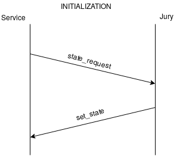
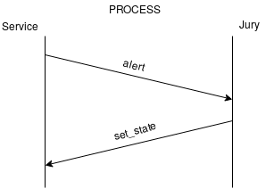
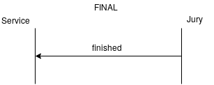

# Протокол прикладного уровня для взаимодействия жюрейки с сервисами
## Описание методов
1. state_request(team)  - сервис запрашивает текущее состояние команды
2. alert(team, timestamp)  - сервис оповещает жюрейку о том, что он был атакован
3. set_state(team, state) - установление состояния команды (заблокирован/разблокирован)
4. finished() - сигнал завершения работы жюрейки
5. error(code) - служебная команда, предупреждающая об ошибках протокола или формата получаемого сообщения и т.д.

## Описание аргументов
1. state - одно из следующих состояний сервиса: lock (сервис заблокирован), unlock (сервис разблокирован)
2. team - идентификатор команды (число)
3. timestamp - время атаки на сервис (POSIX timestamp: datetime.timestamp() or std::time_t)
4. code - один из следующий кодов ошибок: 

## Описание стадий работы протокола
1. Инициализация сервиса - запрос и получение сервисом своего текущего состояния  
   
2. Работа - получение оповещений, блокировка/разблокировка сервиса  
   
3. Конечная стадия - отправка жюрейкой завершающего сигнала  
   

## Описание формата сообщений
1. `state_request: team`
2. `alert: team timestamp`
3. `set_state: team state`
4. `finished`
5. `error: code [description]`